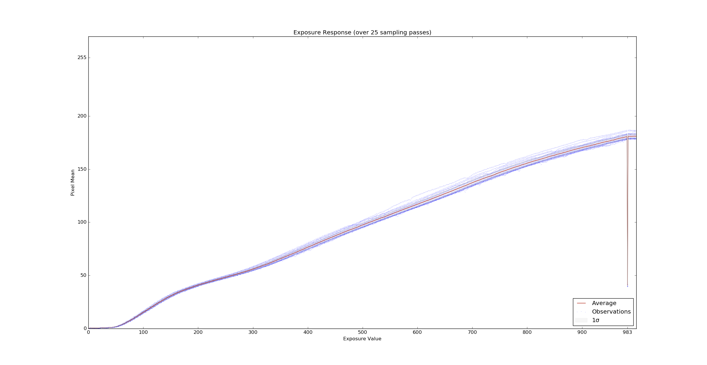
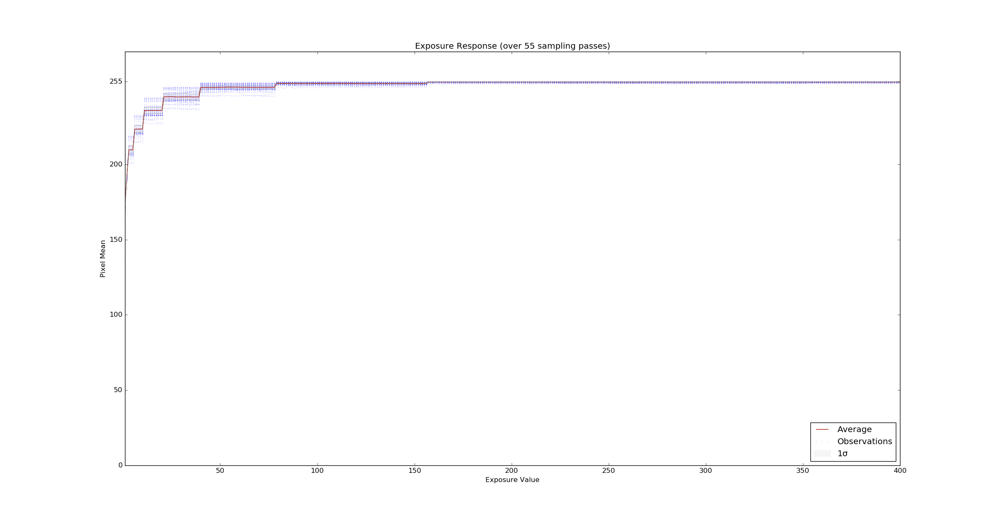

# Description
With the Leopard firmware for camera CX3-OV5640, we cannot achieve small exposure time in manual exposure mode, required for our use case.  
In manual exposure mode, range is too short (400), step is wrong and start with a min exposure too long.  

According to the DataSheet exposure should be encoded on 19bits (i.e. register 0x3500~0x3502).  
But Leopard Imaging firmware exposure_absolute control has only a range between \[0;400\] (please also notice **step** is wrong, 0 instead of 1) 
```sh
v4l2-ctl -d /dev/video-top --all | grep exposure_absolute
exposure_absolute (int)    : min=1 max=400 step=0 default=20 value=20 flags=inactive
```
Further more values don't seems to be linear and start with an exposure time too high.

##Section 4.5 AEC/AGC algorithms
table 4-4

Address | Register name | default value | R/W | description
--------|---------------|---------------|-----|------------
0x3500  | AEC PK EXPOSURE | 0x00  | RW  | Exposure Output Bit[3:0]: Exposure[19:16]
0x3501  | AEC PK EXPOSURE | 0x02  | RW  | Exposure Output Bit[7:0]: Exposure[15:8]
0x3502  | AEC PK EXPOSURE | 0x00  | RW  | Exposure Output Bit[7:0]: Exposure[7:0] Lower four bits are a fraction of a line; they should be 0 since OV5640 does not support fraction line exposure

## Measurement
We have done some measurement of illuminance in manual exposure with the same scene, between the aldebaran ov5640 driver/solution and the leopard one.

Here the measurement with Aldebaran Driver that you can found here
[Aldebaran OV5640 driver](https://github.com/aldebaran/linux-aldebaran/blob/release-2.5.x/atom/drivers/media/i2c/soc_camera/ov5640.c#L1557).  



Here, the measurement with the Leopard solution.


As you can see, leopard driver is much brighter even with the minimum value and we can observe some level step...  
For our use case, we must have **small exposure time** capability for OV5640 !

## Aldebaran Implementation
Please find here, the aldebaran implementation, you should have something similar...  
```C
#define AEC_EXPOSURE_19_16 0x3500
#define AEC_EXPOSURE_15_8 0x3501
#define AEC_EXPOSURE_7_0 0x3502
[...]

static int ov5640_g_exposure(struct v4l2_subdev *sd, __s32 *value) {
	u8 reg_7_0, reg_15_8, reg_19_16;
	struct i2c_client *client = v4l2_get_subdevdata(sd);

	ov5640_reg_read(client, AEC_EXPOSURE_19_16, &reg_19_16);
	ov5640_reg_read(client, AEC_EXPOSURE_15_8, &reg_15_8);
	ov5640_reg_read(client, AEC_EXPOSURE_7_0, &reg_7_0);

	*value=(u32)reg_7_0|(u32)(reg_15_8)<<8|(u32)(reg_19_16)<<16;
	*value = *value >> 4; // lower four bits unavailable
	v4l2_dbg(2, debug, sd, "get exposure: %d\n", *value);
	return 0;
}

static int ov5640_s_exposure(struct v4l2_subdev *sd, int value) {
	struct i2c_client *client = v4l2_get_subdevdata(sd);

	v4l2_dbg(2, debug, sd, "set exposure: %d\n", value);
	value = value << 4; // lower four bits unavailable
	ov5640_reg_write(client, AEC_EXPOSURE_19_16, (value&0xF0000)>>16);
	ov5640_reg_write(client, AEC_EXPOSURE_15_8, (value&0xFF00)>>8);
	ov5640_reg_write(client, AEC_EXPOSURE_7_0, (value&0xF0));

	return 0;
}
```
